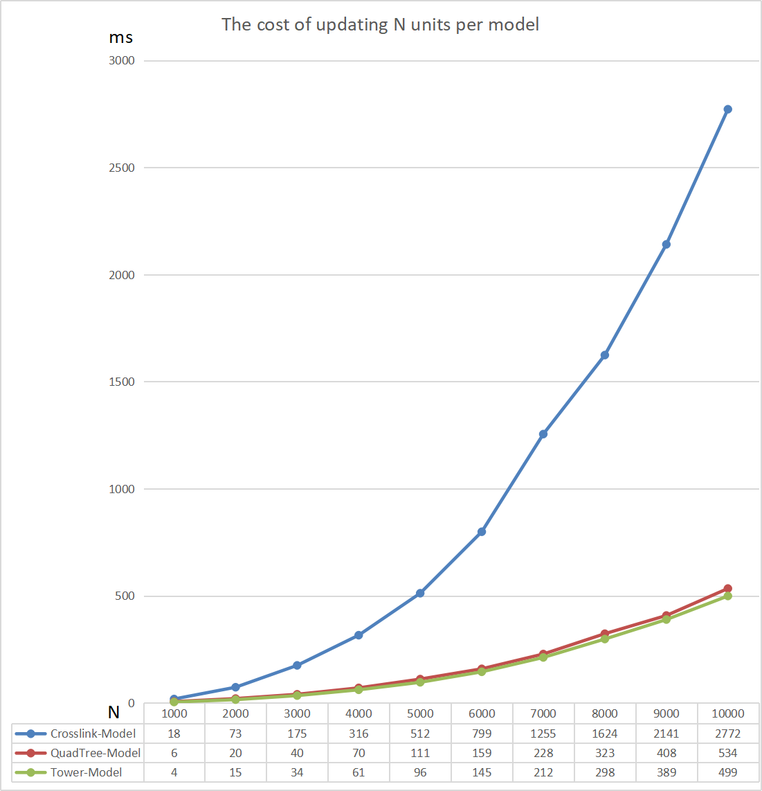

# AOI
Area Of Interest(AOI) is a location service, when a unit defined by (id, x, y) enters or leaves visible range of another unit, the enter event or the leave event fired, and we can also use AOI to query other units near one unit, all of these processes are efficient.
The purpose of this project is to compare the performance of three AOI models. They are Crosslink-Model, QuadTree-Model and Tower-Model.
# Usage
```C++
// eg. We use Tower AOI as an example.
#include "tower_aoi/tower_aoi.h"
#include <cstdio>

// Define map size and visible range
const int kMapWidth = 1024;
const int kMapHeight = 1024;
const int kVisibleRange = 30;

// Define unit enter function
void enter_callback(int me, int other) {
  printf("[unit(%d)] Say: unit(%d) Enter to my range\n", me, other);
}

// Define unit leave function
void leave_callback(int me, int other) {
  printf("[unit(%d)] Say: unit(%d) Leave from my range\n", me, other);
}

void Usage() {
  TowerAOI aoi(kMapWidth, kMapHeight, kVisibleRange, enter_callback,
              leave_callback);
  // Add three units, you need your custom numeric id and the coordinate of unit.
  aoi.AddUnit(1, 1, 1);
  aoi.AddUnit(2, 2, 2);
  aoi.AddUnit(3, 3, 3);
  // Update the coordinate of unit.
  aoi.UpdateUnit(1, 1000, 1000);
  aoi.UpdateUnit(1, 1, 1);
  // Remove the unit.
  aoi.RemoveUnit(1);
}

int main(int argc, char const* argv[]) {
  Usage();
  return 0;
}

Output:
[unit(1)] Say: unit(2) Enter to my range
[unit(2)] Say: unit(1) Enter to my range
[unit(2)] Say: unit(3) Enter to my range
[unit(3)] Say: unit(2) Enter to my range
[unit(1)] Say: unit(3) Enter to my range
[unit(3)] Say: unit(1) Enter to my range
[unit(2)] Say: unit(1) Leave from my range
[unit(1)] Say: unit(2) Leave from my range
[unit(3)] Say: unit(1) Leave from my range
[unit(1)] Say: unit(3) Leave from my range
[unit(3)] Say: unit(1) Enter to my range
[unit(1)] Say: unit(3) Enter to my range
[unit(2)] Say: unit(1) Enter to my range
[unit(1)] Say: unit(2) Enter to my range
[unit(2)] Say: unit(1) Leave from my range
[unit(1)] Say: unit(2) Leave from my range
[unit(3)] Say: unit(1) Leave from my range
[unit(1)] Say: unit(3) Leave from my range
[unit(2)] Say: unit(3) Leave from my range
[unit(3)] Say: unit(2) Leave from my range
```
# Benchmark

The above data was tested on my cpu i7-7700K.\
We simulate N random moves of N units in a 1024*1024 map, each unit has 30 visible range. (1000<=N<=10000)
